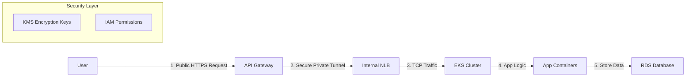

# Enterprise Terraform Modules Library

## 📖 What is this Project?
This repository is a comprehensive **Library of Terraform Modules** designed for building enterprise-grade AWS infrastructure. 

Think of this project as a "LEGO kit" for cloud infrastructure. Instead of writing complex, repetitive code for every new server or database, you can simply pull in these pre-built, secure, and tested modules.

## ❓ Why use this Library?
In an enterprise environment, "clicking around in the console" is not scalable or secure. We use **Infrastructure as Code (IaC)**.

1.  **Standardization**: Every team uses the exact same secure configuration. No one accidentally leaves a database open to the public.
2.  **Speed**: Deploys that took days now take minutes. You just fill in the variables (like specific names or sizes) and the module handles the heavy lifting.
3.  **Compliance**: Built-in guardrails for **SOC2**, **HIPAA**, and **CIS Benchmarks**. Encryption, logging, and private networking are enabled by default.

---

## 🏗️ The "Enterprise Pattern"
This project is designed to support the **Private Microservices Architecture**. This is the industry standard for secure modern applications.

### How it works:
1.  **VPC (Virtual Private Cloud)**: Creates a secure isolated network.
2.  **KMS (Key Management)**: A master key "vault" that handles encryption keys for all other services.
3.  **EKS (Kubernetes)**: The engine that runs your actual application containers. It is kept **private**, meaning no one on the internet can talk to it directly.
4.  **Load Balancer (NLB)**: The bridge that sits inside your private network.
5.  **API Gateway**: The "Front Door". It accepts traffic from the public internet and safely routes it through the VPC Link to your private EKS application.



---

## 📂 Module Directory

### 🔐 Security & Identity
- **[KMS (Key Management)](./modules/aws/kms/README.md)**: 
  - *What*: Manages cryptographic keys.
  - *Why*: Critical for encrypting data in S3, RDS, and EKS without managing physical hardware security modules.
- **[IAM Roles](./modules/aws/iam-roles/README.md)**: 
  - *What*: Defines "Who can do what".
  - *Why*: Ensures your servers only have the exact permissions they need (Least Privilege).

### 🌐 Networking
- **[VPC](./modules/aws/vpc/README.md)**: 
  - *What*: Your private slice of the AWS cloud.
  - *Why*: Provides the foundational network, subnets, and firewalls required for any resource.
- **[API Gateway](./modules/aws/api-gateway/README.md)**: 
  - *What*: A managed service for creating APIs.
  - *Why*: Acts as a secure "front door" for applications, handling throttling, authorization, and traffic management before it hits your servers.
- **[Load Balancer](./modules/aws/load-balancer/README.md)**: 
  - *What*: Distributes incoming traffic.
  - *Why*: Ensures high availability by spreading traffic across multiple servers; essential for connecting API Gateway to EKS.

### 💻 Compute & Orchestration
- **[EKS (Kubernetes)](./modules/aws/eks/README.md)**: 
  - *What*: Managed Kubernetes service.
  - *Why*: The standard for running containerized microservices at scale. Handles upgrades and patching automatically.
- **[Compute (EC2)](./modules/aws/compute/README.md)**: 
  - *What*: Virtual machines.
  - *Why*: Use this for simple workloads, bastion hosts, or legacy applications that don't fit in containers.

### � Observability
| Module | Description |
|--------|-------------|
| [**Observability**](./modules/aws/observability) | **NEW** CloudWatch Log Groups, Alarms, and SNS Notifications |

### �💾 Data & Storage
- **[RDS (Databases)](./modules/aws/rds/README.md)**: 
  - *What*: Managed Relational Databases (PostgreSQL, MySQL).
  - *Why*: Automated backups, patching, and high availability without the headache of managing database servers.
- **[S3 (Storage)](./modules/aws/s3/README.md)**: 
  - *What*: Infinite bucket storage for files.
  - *Why*: Secure retention of logs, documents, and backups with versioning and audit trails.

---

## 🚀 How to Start a New Project

1.  **Clone this repo** (or reference it in your Terraform registry).
2.  **Create your `main.tf`**.
3.  **Block 1: Security & Network**: Start by creating a `vpc` and `kms` key.
4.  **Block 2: Database**: Add an `rds` module using the VPC and KMS Key from step 1.
5.  **Block 3: Compute**: Add an `eks` cluster.
6.  **Run Terraform**: `terraform init` -> `terraform plan` -> `terraform apply`.

---

## 🔐 Compliance Standards
All modules are designed to meet **SOC2**, **HIPAA**, and **CIS Benchmark** requirements:

| Feature | HIPAA | SOC2 | CIS |
|---------|-------|------|-----|
| Encryption at rest | ✅ | ✅ | ✅ |
| Encryption in transit | ✅ | ✅ | ✅ |
| Audit logging | ✅ | ✅ | ✅ |
| VPC Flow Logs | ✅ | ✅ | ✅ |
| Least privilege IAM | ✅ | ✅ | ✅ |
| Private networking | ✅ | ✅ | ✅ |

### 🛡️ Automated Validation
```bash
# Scan for compliance violations
checkov -d modules/aws/ --framework terraform --check hipaa,soc2,cis
tfsec modules/aws/
```

